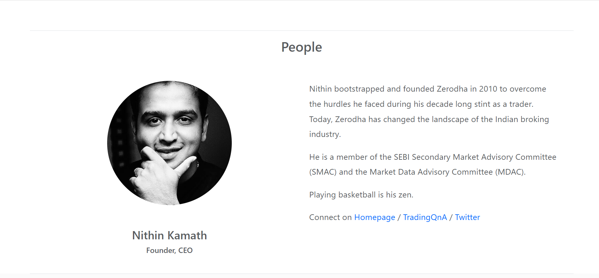
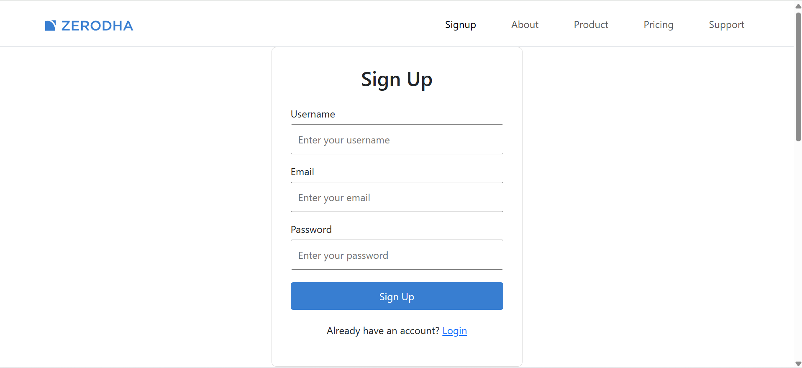
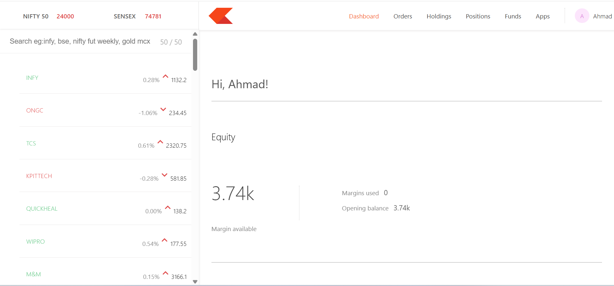
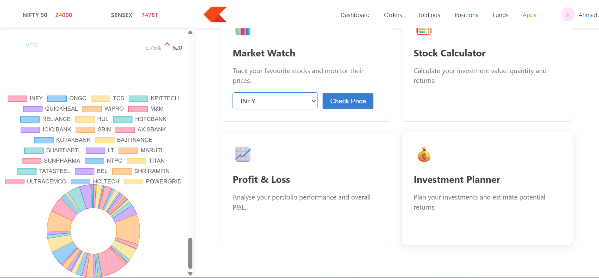
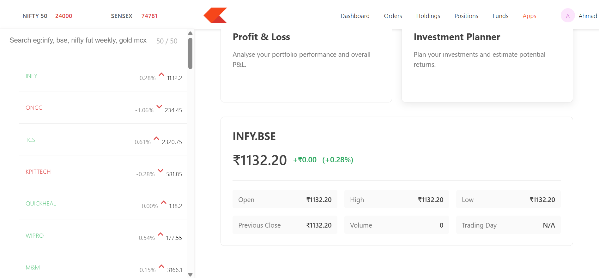
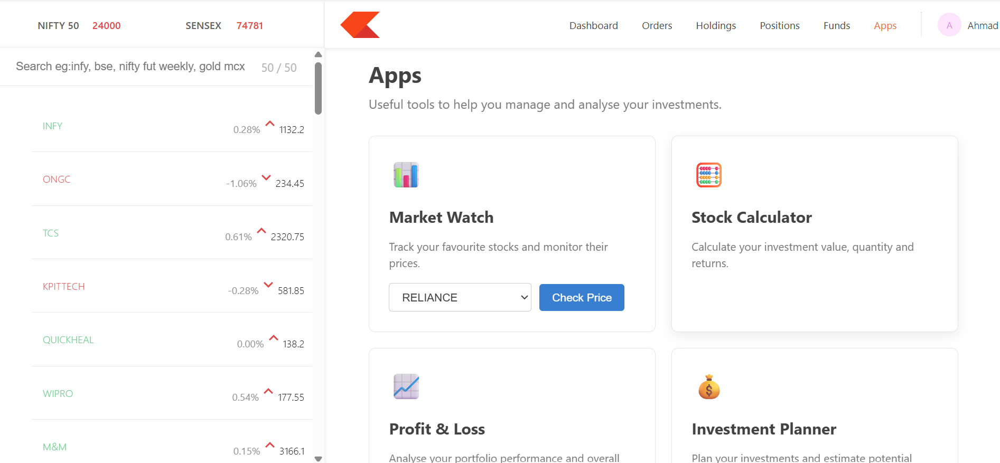
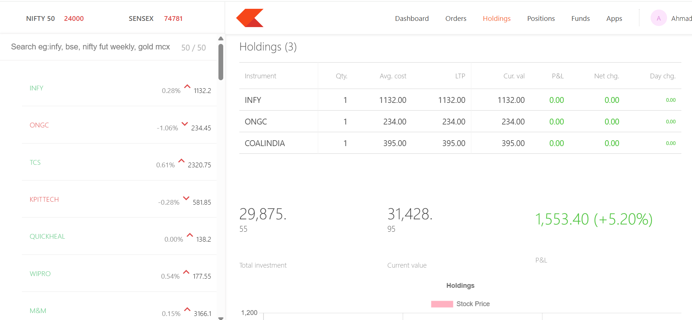
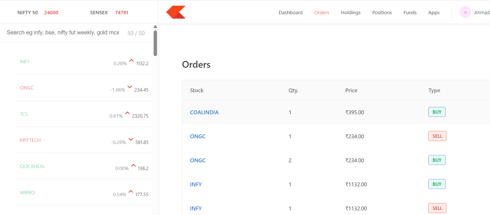
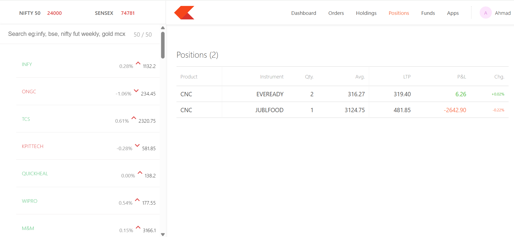
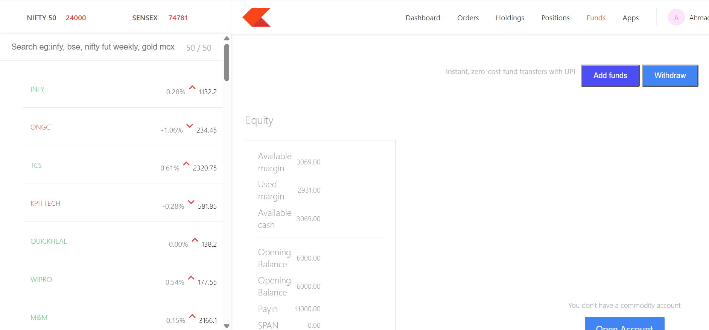

# Trade-Nest 📈

Trade-Nest is a full-stack MERN-based stock trading platform inspired by modern trading platforms such as Zerodha.

The project provides a trading dashboard where users can register, log in, manage funds, view holdings, place orders, check positions, monitor stocks, and view stock price information.

---

## 🌐 Live Demo

### Main Website

https://trade-nest-frontend-peod.onrender.com

### Trading Dashboard

https://trade-nest-dashboard.onrender.com

### Backend API

https://trade-nest-mswy.onrender.com

---

## ✨ Features

- 🔐 User Registration and Login
- 👤 User Profile
- 📊 Trading Dashboard
- 👀 Stock Watchlist
- 📈 Stock Price Checking
- 📉 Stock Charts
- 💰 Funds Management
- ➕ Add Funds
- ➖ Withdraw Funds
- 📦 Holdings Management
- 📝 Order Management
- 📊 Positions
- 🔒 Protected Routes
- 🚪 Logout Functionality
- 🗄️ MongoDB Database
- 🔄 Alpha Vantage API Integration
- 🛡️ MongoDB fallback stock data
- ☁️ Deployment using Render

---

## 🛠️ Technologies Used

### Frontend

- React.js
- React Router
- Axios
- CSS
- React Icons

### Dashboard

- React.js
- React Router
- Axios
- CSS
- React Icons

### Backend

- Node.js
- Express.js
- MongoDB
- Mongoose
- JWT Authentication
- bcrypt.js
- Axios

### APIs & Deployment

- Alpha Vantage API
- MongoDB
- Render

---

## 🏗️ Project Structure

```text
Trade-Nest/
│
├── backend/
│   ├── model/
│   ├── schemas/
│   ├── index.js
│   └── package.json
│
├── frontend/
│   ├── public/
│   ├── src/
│   └── package.json
│
├── dashboard/
│   ├── public/
│   ├── src/
│   └── package.json
│
├── screenshots/
│   ├── About.png
│   ├── Apps.png
│   ├── Chart.png
│   ├── Dashboard.png
│   ├── Funds.png
│   ├── Holdings.png
│   ├── Orders.png
│   ├── Positions.png
│   ├── Signup.png
│   └── StockPrice.png
│
└── README.md
```

---

## 📸 Screenshots

### About / Landing Page


### Sign Up


### Dashboard


### Stock Chart


### Stock Price


### Apps


### Holdings


### Orders


### Positions


### Funds


---

## 🔐 Authentication

Trade-Nest uses JWT-based authentication for user login and protected dashboard functionality.

The authentication flow works as follows:

```
User
  ↓
Sign Up / Login
  ↓
Backend Authentication
  ↓
JWT Token
  ↓
Local Storage
  ↓
Protected Dashboard
```

Users can log out from the profile menu. Logout clears the authentication information and redirects the user back to the main website.

---

## 📈 Stock Market Integration

Trade-Nest integrates the Alpha Vantage API to retrieve stock market information.

Stock information is also stored in MongoDB.

When Alpha Vantage reaches its API limit or does not return stock data, the backend uses stock information stored in MongoDB as fallback data. This allows the application to continue displaying stock information instead of showing an application error.

---

## 💰 Trading Dashboard

The dashboard provides different sections for managing and monitoring trading activity:

- Dashboard
- Orders
- Holdings
- Positions
- Funds
- Apps
- Stock Information
- User Profile

---

## 🚀 Running the Project Locally

### 1. Clone the Repository

```bash
git clone https://github.com/Shaaz29/Trade-Nest.git
cd Trade-Nest
```

### 2. Backend Setup

Navigate to the backend folder:

```bash
cd backend
```

Install dependencies:

```bash
npm install
```

Create a `.env` file inside the backend folder:

```
MONGO_URL=your_mongodb_connection_string
JWT_SECRET=your_jwt_secret
ALPHA_VANTAGE_API_KEY=your_alpha_vantage_api_key
```

Start the backend:

```bash
node index.js
```

Backend runs on:

```
http://localhost:3002
```

### 3. Frontend Setup

Open another terminal and navigate to the frontend:

```bash
cd frontend
```

Install dependencies:

```bash
npm install
```

Start the frontend:

```bash
npm start
```

Frontend runs on:

```
http://localhost:3000
```

### 4. Dashboard Setup

Open another terminal and navigate to the dashboard:

```bash
cd dashboard
```

Install dependencies:

```bash
npm install
```

Start the dashboard:

```bash
npm start
```

Dashboard runs on:

```
http://localhost:3001
```

---

## 🔗 Important API Endpoints

```
POST /signup
POST /login
GET  /profile

GET  /funds
POST /addFunds
POST /withdrawFunds

GET  /allHoldings
GET  /allOrders
GET  /allPositions

POST /newOrder

GET  /stocks
GET  /stock/:symbol
```

---

## ☁️ Deployment

Trade-Nest is deployed using Render.

```
                    Trade-Nest
                        │
          ┌─────────────┼─────────────┐
          ↓             ↓             ↓
      Frontend       Dashboard      Backend
       Render          Render        Render
                                      │
                                      ↓
                                   MongoDB
                                      │
                                      ↓
                              Alpha Vantage API
```

### Deployment URLs

**Frontend**
https://trade-nest-frontend-peod.onrender.com

**Dashboard**
https://trade-nest-dashboard.onrender.com

**Backend**
https://trade-nest-mswy.onrender.com

---

## 🔮 Future Improvements

- Real-time stock price updates
- Improved stock price caching
- Advanced portfolio analytics
- Buy/Sell trading interface
- Improved stock charts
- More market indicators
- Improved mobile responsiveness
- Additional trading features

---

## 👨‍💻 Author

**Ahmad Shaaz**

MCA Graduate | Full Stack Developer | Python & Django Developer

GitHub: https://github.com/Shaaz29

---

## ⭐ Support

If you like this project, consider giving the repository a ⭐ on GitHub.
